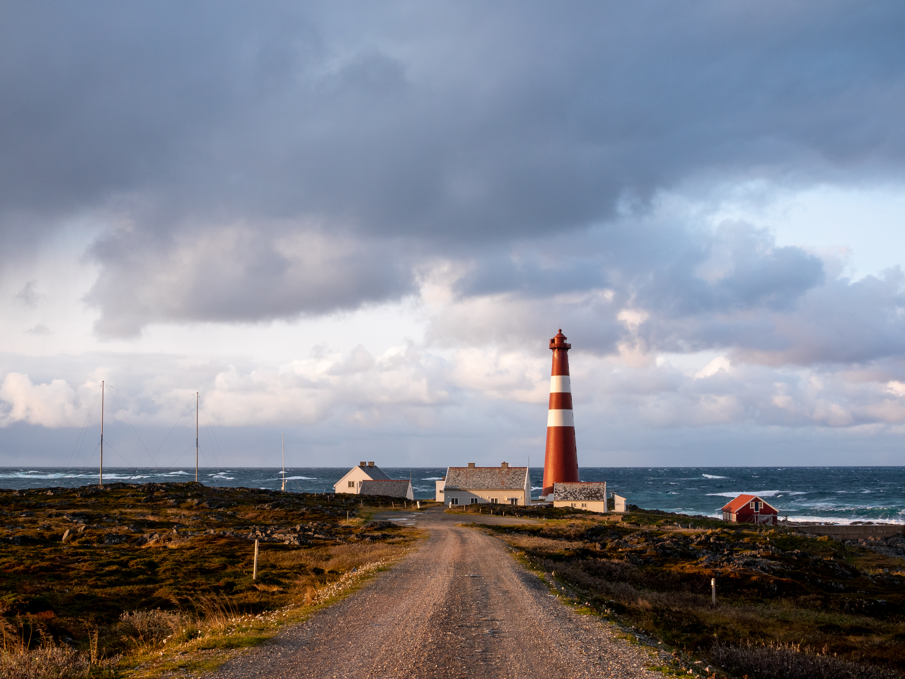

import ArticleImage from '/src/components/articleImage.astro';
import ImageGrid from '/src/components/imageGrid.astro';
import Blockquote from '/src/components/blockquote.astro';
import ArrowLink from '/src/components/arrowLink.astro'

## Prosjektet i et nøtteskall 

Pilotprosjektet «Nyskapande aktivitetsanlegg for uorganisert aktivitet» er et mulighetsstudie for hvordan et aktivitetshus kan bidra til å løse utfordringer knyttet til ungt utenforskap og uønsket ungdomsadferd på Ågotnes. 

<ArticleImage 
    imagePath="nettside.jpg"
    altText="Alt"
    caption="Test av large image component"
    sizeSML="m"
/>

Dette har vi utviklet gjennom å involvere både ungdom i målgruppa, ungdomsarbeidere, skolene og politiet for virkelig forstå behovene og hva som skal til for å bedre situasjonen. Involveringen har skjedd i flere runder og ved bruk av dybdeintervjuer, observasjon, panelsamtaler og brukertesting. Resultatet er et løsningsforslag for et fleksibelt sosialt møtested som kan huse et mangfold av fysiske og kreative aktiviteter, funksjoner og kommunale tjenester. Offentlig og frivillig
samlokalisering vil sikre åpningstider, voksentetthet og en økonomisk bærekraftig drift.

<Blockquote
    sitat="Vi har aldri brukt mer penger på å bygge aktivitetsanlegg enn vi gjør nå, likevel faller tallet på deltakere i organisert fritidsaktivitet. Det ser ikke ut til at det er noen sammenheng mellom penger inn og verdi ut. Da er vi nødt til å tenke nytt og annerledes."

    kilde="Ola Mattsson, Lokale og Anlægsfonden"
    
    imagePath="nettside.jpg"
    imageFilter="0.4"
    altText="Alt"
/>

## Bakgrunn

Bakgrunnen for prosjektet er at ungdom på Ågotnes savner lavterskel fritidstilbud, møtesteder og fysisk aktivitet ut over de tradisjonelle lagidrettene. Konsekvensen er at noen ungdom oppsøker spenning og til dels mestring gjennom hærverk, vold og andre uønskede aktiviteter. Andre ungdom isolerer seg og bruker mye tid foran mobil eller PC og får ikke de sosiale ferdighetene livet krever.

Dette er komplekse utfordringer som et aktivitetshus ikke kan løse alene. Men ved å se prosjektet i sammenheng med annen innsats fra skolen, ungdomsarbeidere og barnevernet kan aktivitetsanlegget bli en viktig sosial og forebyggende sosial infrastruktur. Målet for prosjektet er derfor ikke å komme fram til et ferdig løsningsforslag, men å heller identifisere hva som er de rette løsningene.

<ImageGrid>

    <ArticleImage 
    imagePath="nettside.jpg"
    altText="Alt"
    caption="Bilde 1 til test av image grid"
    />

    <ArticleImage 
    imagePath="nettside.jpg"
    altText="Alt"
    caption="Bilde 2 til test av image grid"
    />

</ImageGrid>

## Tilnærming

Prosessen vår har vært tredelt og fulgt designdrevet innovasjonsmetodikk. Målet var å forstå hva som skal til for å lage et tilbud ungdom vil bruke, erfarne voksne mener vil hjelpe og hva som er økonomisk gjennomførbart.

I første del har vi utelukkende fokusert på å sette oss inn i utfordringene. Vi har lært om ungdom sin hverdag på Ågotnes, og hvordan voksne ressurspersoner opplever utfordringene. Vi har brukt mye tid på dette fordi en dårlig problem-forståelse vil sende hele prosjektet ut på feil kurs. 

Først i del to begynte vi å utforske mulige løsninger: Både mulig bruk og aktivitetstilbud, tjenester og fysisk utforming av et aktivitetsanlegg. For å evaluere hvilke løsninger som treffer på behovene, involverte vi både ungdom og voksne ressurspersoner på ny.

I siste del av prosessen samlet vi trådene for å levere et konkret mulighetsstudie.

<Blockquote
    sitat="Det e sju år siden æ har hatt en or'ntlig fæst!"
    kilde="Sindre, 7 år"
    imageFilter="0.7"
    altText="Alt"
/>

## Leveranse

In at ligula pretium quam dignissim tempus at et nisl. Nam dignissim sed nulla eu pulvinar. Mauris vestibulum dapibus tortor, at posuere sapien elementum ac. Donec tristique est ipsum, sed cursus diam eleifend vel. Cras id arcu eu leo congue dapibus. In porttitor euismod iaculis. Cras sapien sem, tincidunt et tempor non, efficitur ut nisi. Pellentesque id lacus turpis. Donec mollis, ipsum nec dictum euismod, ex sem feugiat diam, sed luctus dolor justo quis lorem. Sed ut felis eleifend, ultricies ligula id, tincidunt dolor. Suspendisse quis semper justo. Integer id orci rhoncus, pellentesque ligula quis, auctor justo. Cras quis lectus in erat fermentum fringilla. Sed molestie nulla orci, eget egestas tortor sagittis a. Nunc sagittis lorem ac urna euismod sagittis. Aliquam sit amet blandit augue, quis blandit lectus.

Aenean hendrerit est velit, vel blandit mi ultricies non. Ut blandit ipsum eu hendrerit sagittis. Donec eu dignissim neque. Fusce vitae libero sed elit aliquet faucibus a et nisl. Curabitur lacinia in orci at placerat. Nullam lacinia eros eu justo vestibulum aliquet vitae quis orci. Vivamus magna justo, lobortis non nulla sit amet, sagittis dignissim ipsum. Nunc nec velit ut risus bibendum fringilla in id nibh. In nec diam consequat nisl feugiat mattis. Suspendisse volutpat mattis accumsan. Maecenas ligula felis, scelerisque ut ipsum vitae, fringilla malesuada urna. Cras tristique, turpis at varius eleifend, velit nunc ultricies turpis, fermentum laoreet lectus neque vel sem. Vivamus sed velit felis. Sed risus mauris, dignissim vitae eleifend sit amet, ultricies id lacus. Cras aliquet euismod interdum. 

<ArrowLink ekstern={false} text='Her kan du lese hele rapporten fra prosjektet.' url='https://www.jottacloud.com/s/303f20665db713947308c4f081d13ec8ead'/>

***

## Medieomtale

<ArrowLink ekstern={true} text='Lokalsak: Slik skal de løse ungdomsproblemene på Ågotnes' url='https://www.vestnytt.no/nyheter/i/onjw8j/slik-skal-de-loese-ungdomsproblemene-paa-aagotnes'/>