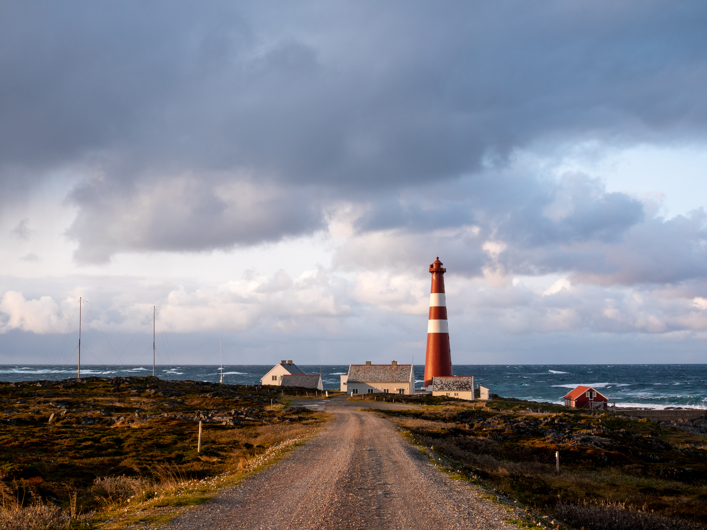

import ArticleImage from '/src/components/articleImage.astro';
import ImageGrid from '/src/components/imageGrid.astro';
import Blockquote from '/src/components/blockquote.astro';
import ArrowLink from '/src/components/arrowLink.astro'
import Video from '/src/components/video.astro';

## Prosjektet i et nøtteskall 

Kragerø kommunes Gnist-prosjekt utforsker hvordan «omkampenes by» kan arbeide både praktisk og strategisk med å bygge kultur for god medvirkning mellom kommune, innbyggere, frivillighet og næringsliv. Målet er å få til en utvikling innbyggerne føler eierskap til og kan være stolte av. Dette har vi gjort gjennom å bygge praktisk erfaring, nettverk og grobunn for innbyggerinnvolvering som bygger på lokale forutsetninger, er motiverende å delta i, og ikke minst er nyttig
for kommunen i plan- og utviklingsarbeid.

<ArticleImage 
    imagePath="nettside.jpg"
    altText="Alt"
    caption="Test av large image component"
    sizeSML="l"
/>

Resultatet er en ny forståelse og en spirende kultur i kommunen for hva som skal til for å reelt engasjere innbyggere og andre aktører i byutvikling. Dette er formalisert som et kapittel om medvirkning i ny planstrategi, et nytt kommunikasjonsteam, forslag til videre testing og et sett med fokusområder kommunen må fortsette å ha i bakhodet.

Verdien av dette er at kommunen nå har blitt bedre rustet til å stå i fremtidige og vanskelige byutviklingsspørsmål, som utvikling av havnefronten-tomta og å finne løsninger i lys av å nylig bli en ROBEK-kommune.

<Blockquote
    sitat="I den tradisjonelle distriktspolitikken har intensjonen primært vært å møte utfordringene med tiltak for næringsutvikling og jobbskaping. Utvalget mener at utfordringene er mer sammensatte, og at de følgelig må møtes med et langt bredere spekter av tiltak. Tilgang til gode tjenester er viktig for alle, men krever andre løsninger i områder med spredt bosetting."

    kilde="NOU (2020) Det handler om Norge – Utredning om konsekvenser av demografiutfordringer i distriktene"
    
    imagePath="nettside.jpg"
    imageFilter="0.4"
    altText="Alt"
/>

## Bakgrunn

I 2023 ble Kragerø valgt ut til å delta i Gnist-programmet. Et nasjonalt innovasjonsprogram for distriktsnorge ledet av Design og Arkitektur Norge med støtte fra Nordic Edge og Distriktssenteret. Målet for programmet er å utvikle bærekraftige og stedstilpassa løsninger knyttet til steds- og næringsutvikling.

Kragerø sin Gnist-utfordring tok utgangspunkt i at utviklinga av byen ofte stopper opp i polarisert krangel, spesielt rundt havnefronten i sentrum. Slagordet er å gå fra utbyggerstyrt til innbyggerstyrt byutvikling. 

Tidligere har flere store aktører vært inne for å jobbe med medvirkning, men av ulike grunner har arbeidet ikke ledet til resultater innbyggerne kjenner seg igjen i. Etter mange år med uønsket utvikling er konfliktnivået høyt, medvirkningstrøttheten stor, og både næringslivet, kommunen og innbyggere fortvilet.

Hvordan kan kommunen komme i stand til å involvere innbyggerne på gode måter og til rett tid, og ikke minst at medvirkningen faktisk fører til bedre planer og synlige resultater?

<ImageGrid>

    <ArticleImage 
    imagePath="nettside.jpg"
    altText="Alt"
    caption="Bilde 1 til test av image grid"
    sizeSML="m"
    />

    <ArticleImage 
    imagePath="nettside.jpg"
    altText="Alt"
    caption="Bilde 2 til test av image grid"
    sizeSML="m"
    />

</ImageGrid>

## Tilnærming

For å forstå hvordan Kragerø kan gå fra en utbyggerstyrt til innbyggerstyrt kultur måtte vi først bli bedre kjent med kulturen og stedet slik det er i dag. Over ei intensiv uke gjennomførte Lokalt Byrå over 30 intervjuer med kommunens administrasjon, frivilligheten, næringslivet og andre ildsjeler.

I samtalene fikk vi bekrefta at situasjonen i Kragerø er kompleks og hverken har én rotårsak eller én løsning. Basert på intervjuene arbeidet vi frem hypoteser for hvilke utfordringer og muligheter gnist-prosjektet burde jobbe med, og hensyn som må taes. Kommunehverdagen er hektisk, og om medvirkning oppleves som “ekstraarbeid” vil det neppe føre frem, til tross for at regjeringen er tydelig på at tidlig medvirkning bidrar til bedre planer og færre konflikter. Innbyggerne etterlyser også synligere prosesser og resultater.

<Blockquote
    sitat="Det er klart at vi som er litt eldre og sitter på kontor, vi klarer ikke alltid
å se de samme løsningene som de unge, så spør dem da, spør de som
skal bruke det."
    kilde="Rådgiver i Kragerø kommune"
    imageFilter="0.7"
    altText="Alt"
/>

Gjennom en testuke med base i en tom bygård i sentrum arrangerte prosjektgruppa en rekke tester hvor målet, basert på innsikten, var å styrke forståelsen og kulturen for god medvirkning i praksis, og samtidig lære mer om de lokale forutsetningene for dette. 

<ImageGrid>

    <ArticleImage 
    imagePath="nettside.jpg"
    altText="Alt"
    caption="Bilde 1 til test av image grid"
    sizeSML="m"
    />

    <ArticleImage 
    imagePath="nettside.jpg"
    altText="Alt"
    caption="Bilde 2 til test av image grid"
    sizeSML="m"
    />

</ImageGrid>

For å ta prosessen et steg videre, samarbeidet vi med Kragerø Videregående skole om å tolke innbyggernes innspill fra testuka gjennom deres årlige innovasjonscamp. Sammen med 90 ungdommer på tvers av linjene, 200 paller på låns fra Maxbo og 2 dager til rådighet, bygget vi 11 installasjoner som eksemplifiserer muligheter for hva havnefronten kan brukes til. Installasjonene som kom ut av innovasjonscampen adresserer ikke direkte de mest betente formålene som bolig og næringslokaler. Men diskusjonene som installasjonene utløste handlet om de mindre og billigere tiltakene man kan få til på kort sikt i påvente av de større investeringene.

<Video
    src='Vekstkonferansen_720.mp4'
    imagePlaceholder='camp_720.jpg'
/>

På mange måter er dette en byutviklingsstrategi i en mer menneskeorientert skala. Ved å først begynne med de lavthengende fruktene kan man aktivisere området, gi det en identitet og etablere en aktivitet å bygge rundt. Om tiltakene treffer feil, så er det heldigvis enkelt og billig å gjøre om på det, fordi vi vet ikke ordentlig hva som funker før vi ser det i bruk. På denne måten slipper vi å gjøre store investeringer og transformasjoner som vi må fylle med aktivitet i ettertid og krysse fingrene for at treffer. 

<ImageGrid>

    <ArticleImage 
    imagePath="nettside.jpg"
    altText="Alt"
    caption="Ivrig bygging på havnefronten"
    sizeSML="m"
    />

    <ArticleImage 
    imagePath="nettside.jpg"
    altText="Alt"
    caption="Installasjon"
    sizeSML="m"
    />

    <ArticleImage 
    imagePath="nettside.jpg"
    altText="Alt"
    caption="Juryen på vift"
    sizeSML="l"
    />

</ImageGrid>

## Leveranse 

Gnist-prosjektet sin leveranse er å ha satt i gang en kultur- og kompetanseutvikling for å ruste Kragerø kommune til å bedre håndtere fremtidig by- og samfunnsutvikling. Dette har vi «levert» gjennom de praktiske erfaringene vi har gjort oss sammen med kommunens administrasjon. Gjennom testene har vi utforsket hvordan ulike grep treffer innbyggere på ulike måter, og hvordan resultatene kan utnyttes på synlige, engasjerende og nyttige måter.

Tidligere forsøk på å utvikle byen har stoppet opp nettopp på grunn av manglende prosesser, og kultur og kompetanse for å gjennomføre dem. Prosjektet er derfor en generalprøve for hvordan medvirkning kan brukes eksempelvis i den kommende planprosessen rundt havnefrontsområdet for å virkelig engasjere byen inn i planarbeidet.

Å bli god på medvirkning tar tid. Vi har ikke kommet i mål på seks måneder, og heller ikke utviklet en ferdig «løsning» på problemet. Men det er heller ikke mulig for denne typen utfordring. Kragerø må fortsette utprøvingen, læringen og gradvis forbedre rutinene for å involvere innbyggerne.

Prosjektet har blant annet resultert i et nytt kapittel om medvirkning i planstrategien, et tverrsektorielt kommunikasjonsteam, nye frivillige initiativ for mikroforskjønning av byen, nye verktøy, metoder, know-how og praktisk erfaring for å utvikle en organisasjon som jobber og tenker på nye og mer samskapende måter.

<ArrowLink ekstern={false} text='Her kan du lese hele rapporten fra prosjektet.' url='https://www.jottacloud.com/s/303b14b7db098c64a009a0bda3796aaf7e0'/>

***

## Medieomtale

<ArrowLink ekstern={true} text='Kronikk: Kan vi lage noe nytt for å snakke om noe nytt?' url='https://www.kv.no/kan-vi-lage-noe-nytt-for-a-snakke-om-noe-nytt/s/5-63-615726'/>

<ArrowLink ekstern={true} text='Lokalsak: Testuka til Gnist-prosjektet har gått over all forventing: – Vi er overveldet' url='https://www.kv.no/testuka-til-gnist-prosjektet-har-gatt-over-all-forventing-vi-er-overveldet/s/5-63-603940'/>

<ArrowLink ekstern={true} text='Lokalsak: Denne gjengen er klar for en uke med aktiviteter i sentrum: – Målet er å gjøre ting man ikke er vant med' url='https://www.kv.no/denne-gjengen-er-klar-for-en-uke-med-aktiviteter-i-sentrum-malet-er-a-gjore-ting-man-ikke-er-vant-med/s/5-63-600651'/>

<ArrowLink ekstern={true} text='Lokalsak: Kragerø skal bli mer innbyggerstyrt: – Har pekt ut ti områder' url='https://www.kv.no/kragero-skal-bli-mer-innbyggerstyrt-har-pekt-ut-ti-omrader/s/5-63-591130'/>